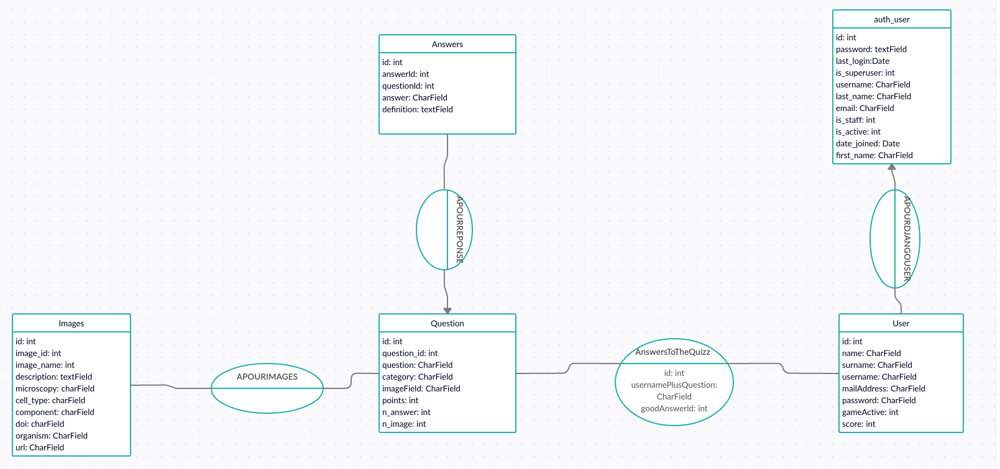

Auteur: **Hugo MARTIN**\
Date: **11/11/2020**


# Web Programming Project


[Introduction](#introduction)\
[Introducing the project folder](#introducing-the-project-folder)\
[Pre-requisites](#pre-requisites)\
[Conda Environment](#conda-environment)\
[git](#git)\
[Local Website Deployment](#local-website-deployment)\
[Website Deployment on Heroku](#website-deployment-on-heroku)\
[Django](#django)\
[Database MCD Diagram](#database-mcd-diagram)\
[Used javascript librairies](#used-javascript-librairies)\
[Personalized Django commands](#personalized-django-commands)\
[Improvements](#improvements)


<br>

## Introduction 

The goal of this project was to create a Web interface written with the **Django** framework to test users on their knowledge concerning Microscopy. Quizz pictures come from the [Cell Image Library](http://www.cellimagelibrary.org/home).

<br>

## Introducing the project folder

This project is composed of several folders and files such as:
 
<br>

### [prograweb_project](prograweb_project)
- [Documentation](../Documentation)
  - [README.md](./README.md)
- [Miniconda](../Miniconda)
  - [djangoenv.yaml](../Miniconda/djangoenv.yaml)
- [Webpage](../Webpage)
  - [MicroscopyQuizz](../Webpage/MicroscopyQuizz)
    - [Table](../Webpage/MicroscopyQuizz/Table)
      - [table_answer.csv](../Webpage/MicroscopyQuizz/Table/table_answer.csv)
      - [table_question.csv](../Webpage/MicroscopyQuizz/Table/table_question.csv)
      - [tables_images.csv](../Webpage/MicroscopyQuizz/Table/tables_images.csv)
    - [\__init\__.py](../Webpage/MicroscopyQuizz/\__init\__.py)
    - [\__pycache\__](../Webpage/MicroscopyQuizz/\__pycache\__)
    - [admin.py](../Webpage/MicroscopyQuizz/admin.py)
    - [apps.py](../Webpage/MicroscopyQuizz/apps.py)
    - [forms.py](../Webpage/MicroscopyQuizz/forms.py)
    - [migrations](../Webpage/MicroscopyQuizz/migrations)
    - [models.py](../Webpage/MicroscopyQuizz/models.py)
    - [static](../Webpage/MicroscopyQuizz/static)
      - [JS](../Webpage/MicroscopyQuizz/static/JS)
        - [QuizzAnswers.js](../Webpage/MicroscopyQuizz/static/JS/QuizzAnswers.js)
        - [QuizzAnswersComponent.js](../Webpage/MicroscopyQuizz/static/JS/QuizzAnswersComponent.js)
        - [QuizzTemplateComponent.js](../Webpage/MicroscopyQuizz/static/JS/QuizzTemplateComponent.js)
        - [QuizzTemplateMicroscopy.js](../Webpage/MicroscopyQuizz/static/JS/QuizzTemplateMicroscopy.js)
        - [homeSignedIn.js](../Webpage/MicroscopyQuizz/static/JS/homeSignedIn.js)
        - [jquery](../Webpage/MicroscopyQuizz/static/JS/jquery)
          - [jquery-3.5.1.js](../Webpage/MicroscopyQuizz/static/JS/jquery/jquery-3.5.1.js)
          - [jquery-3.5.1.min.js](../Webpage/MicroscopyQuizz/static/JS/jquery/jquery-3.5.1.min.js)
          - [jquery-ui-1.12.1](../Webpage/MicroscopyQuizz/static/JS/jquery/jquery-ui-1.12.1)
            - [index.html](../Webpage/MicroscopyQuizz/static/JS/jquery/jquery-ui-1.12.1/index.html)
            - [jquery-ui.css](../Webpage/MicroscopyQuizz/static/JS/jquery/jquery-ui-1.12.1/jquery-ui.css)
            - [jquery-ui.js](../Webpage/MicroscopyQuizz/static/JS/jquery/jquery-ui-1.12.1/jquery-ui.js)
            - [jquery-ui.min.css](../Webpage/MicroscopyQuizz/static/JS/jquery/jquery-ui-1.12.1/jquery-ui.min.css)
            - [jquery-ui.min.js](../Webpage/MicroscopyQuizz/static/JS/jquery/jquery-ui-1.12.1/jquery-ui.min.js)
            - [jquery-ui.structure.css](../Webpage/MicroscopyQuizz/static/JS/jquery/jquery-ui-1.12.1/jquery-ui.structure.css)
            - [jquery-ui.structure.min.css](../Webpage/MicroscopyQuizz/static/JS/jquery/jquery-ui-1.12.1/jquery-ui.structure.min.css)
            - [jquery-ui.theme.css](../Webpage/MicroscopyQuizz/static/JS/jquery/jquery-ui-1.12.1/jquery-ui.theme.css)
            - [jquery-ui.theme.min.css](../Webpage/MicroscopyQuizz/static/JS/jquery/jquery-ui-1.12.1/jquery-ui.theme.min.css)
            - [package.json](../Webpage/MicroscopyQuizz/static/JS/jquery/jquery-ui-1.12.1/package.json)
        - [modifingLogin.js](../Webpage/MicroscopyQuizz/static/JS/modifingLogin.js)
        - [searchImages.js](../Webpage/MicroscopyQuizz/static/JS/searchImages.js)
        - [searchImagesResults.js](../Webpage/MicroscopyQuizz/static/JS/searchImagesResults.js)
        - [userLogined.js](../Webpage/MicroscopyQuizz/static/JS/userLogined.js)
      - [css](../Webpage/MicroscopyQuizz/static/css)
        - [base.css](../Webpage/MicroscopyQuizz/static/css/base.css)
        - [baseForQuizz.css](../Webpage/MicroscopyQuizz/static/css/baseForQuizz.css)
      - [images](../Webpage/MicroscopyQuizz/static/images)
        - [formulaire.png](../Webpage/MicroscopyQuizz/static/images/formulaire.png)
        - [halacious-OgvqXGL7XO4-unsplash.jpg](../Webpage/MicroscopyQuizz/static/images/halacious-OgvqXGL7XO4-unsplash.jpg)
        - [images.jpeg](../Webpage/MicroscopyQuizz/static/images/images.jpeg)
        - [logo.png](../Webpage/MicroscopyQuizz/static/images/logo.png)
        - [microscopy-optical_pic1.jpg](../Webpage/MicroscopyQuizz/static/images/microscopy-optical_pic1.jpg)
        - [neuron.jpg](../Webpage/MicroscopyQuizz/static/images/neuron.jpg)
        - [registerhere.jpg](../Webpage/MicroscopyQuizz/static/images/registerhere.jpg)
        - [trophee.jpg](../Webpage/MicroscopyQuizz/static/images/trophee.jpg)
        - [userpicture.png](../Webpage/MicroscopyQuizz/static/images/userpicture.png)
    - [templates](../Webpage/MicroscopyQuizz/templates)
      - [Classment](../Webpage/MicroscopyQuizz/templates/Classment)
        - [classmentTemplate.html](../Webpage/MicroscopyQuizz/templates/Classment/classmentTemplate.html)
      - [ImagesSearchBar](../Webpage/MicroscopyQuizz/templates/ImagesSearchBar)
        - [imageSearchBar.html](../Webpage/MicroscopyQuizz/templates/ImagesSearchBar/imageSearchBar.html)
        - [imageSearchBarResults.html](../Webpage/MicroscopyQuizz/templates/ImagesSearchBar/imageSearchBarResults.html)
      - [base](../Webpage/MicroscopyQuizz/templates/base)
        - [base.html](../Webpage/MicroscopyQuizz/templates/base/base.html)
        - [baseForLogined.html](../Webpage/MicroscopyQuizz/templates/base/baseForLogined.html)
        - [baseForQuizz.html](../Webpage/MicroscopyQuizz/templates/base/baseForQuizz.html)
      - [home](../Webpage/MicroscopyQuizz/templates/home)
        - [home.html](../Webpage/MicroscopyQuizz/templates/home/home.html)
        - [homeSignedIn.html](../Webpage/MicroscopyQuizz/templates/home/homeSignedIn.html)
      - [quizzTemplate](../Webpage/MicroscopyQuizz/templates/quizzTemplate)
        - [quizzChoicesTemplate.html](../Webpage/MicroscopyQuizz/templates/quizzTemplate/quizzChoicesTemplate.html)
        - [quizzTemplateAnswers.html](../Webpage/MicroscopyQuizz/templates/quizzTemplate/quizzTemplateAnswers.html)
        - [quizzTemplateAnswersMicroscopy.html](../Webpage/MicroscopyQuizz/templates/quizzTemplate/quizzTemplateAnswersMicroscopy.html)
        - [quizzTemplateComponent.html](../Webpage/MicroscopyQuizz/templates/quizzTemplate/quizzTemplateComponent.html)
        - [quizzTemplateMicroscopy.html](../Webpage/MicroscopyQuizz/templates/quizzTemplate/quizzTemplateMicroscopy.html)
      - [registration](../Webpage/MicroscopyQuizz/templates/registration)
        - [login.html](../Webpage/MicroscopyQuizz/templates/registration/login.html)
      - [signUp](../Webpage/MicroscopyQuizz/templates/signUp)
        - [formSignUp.html](../Webpage/MicroscopyQuizz/templates/signUp/formSignUp.html)
    - [tests.py](../Webpage/MicroscopyQuizz/tests.py)
    - [views.py](../Webpage/MicroscopyQuizz/views.py)
  - [Pipfile](../Webpage/Pipfile)
  - [Procfile](../Webpage/Procfile)
  - [Webpage](../Webpage/Webpage)
    - [\__init\__.py](../Webpage/Webpage/\__init\__.py)
    - [\__pycache\__](../Webpage/Webpage/\__pycache\__)
    - [settings.py](../Webpage/Webpage/settings.py)
    - [static](../Webpage/Webpage/static)
      - [humans.txt](../Webpage/Webpage/static/humans.txt)
    - [urls.py](../Webpage/Webpage/urls.py)
    - [wsgi.py](../Webpage/Webpage/wsgi.py)
  - [database_json](../Webpage/database_json)
    - [datadump.json](../Webpage/database_json/datadump.json)
  - [db.sqlite3](../Webpage/db.sqlite3)
  - [manage.py](../Webpage/manage.py)
  - [requirements.txt](../Webpage/requirements.txt)
  - [scripts](../Webpage/scripts)
    - [\__init\__.py](../Webpage/scripts/\__init\__.py)
    - [\__pycache\__](../Webpage/scripts/\__pycache\__)
    - [addURLs.py](../Webpage/scripts/addURLs.py)
    - [parserTable.py](../Webpage/scripts/parserTable.py)
  - [static](../Webpage/static)
    - [humans.txt](../Webpage/static/humans.txt)
  - [staticfiles](../Webpage/staticfiles)

- [heroku](../heroku)
  - [install_heroku.sh](../heroku/install_heroku.sh)

--- 

<br>

**Documentation** is the folder containing all the documentation about the project.

**Miniconda** is the folder containing the Miniconda environment to deploy a local version of the website.

**heroku** is the folder containing the heroku installation script to deploy the website on the heroku platform.

The first folder **Webpage** is the folder containing all the files required for the website good support.The second one contains all the files dedicated to the website parameters (URLs initialisation, parameters file).

**static** folders contain all the files for the website aesthetics and for the different views composing the website. 

**Table** is the folder containing all the csv files which one have been used to initialise the website database.

**scripts** is the folder containing all the .py files initialising personalized commands linked to the project.

**templates** is the folder containing all the HTML files used as templates for the website.

**forms.py** is the file initialising all the forms used in the website.

**models.py** is the file initialising all the databases tables.

<br>

## Pre-requisites

**This documentation is uniquely dedicated to the UNIX systems (Linux/Mac) users.**

To install the local implementation of the web interface or on heroku, you would need to install **git** and **Miniconda** on your computer.
If it is not the case, see the other sections concerning these tools.

<br>

## Conda Environment 

A **Conda** environment is available in the **Miniconda** folder, to use it, you must firstly install **Miniconda** or **Anaconda** on your computer.

<br>

### First use of Conda

If you never used **Miniconda**, you can download it by following this [link](https://docs.conda.io/en/latest/miniconda.html).

After installing **Miniconda**, if you are on a **UNIX** system, don't forget to add the **Miniconda3/bin** folder to the **PATH** variable of your computer. It allows to use **Conda** commands everywhere in your Operating System.

<br>

### Deploying the Conda environment on your computer

To deploy the **Conda** environment on your computer, reach the **Miniconda** folder in the project folder. Then, use the command: 

<br>

```{bash}
conda env create -f djangoenv.yml 
```
<br>

To deploy the **Conda** environment.


<br>

### Use of the Conda environment

To use the **Conda** environment on your computer, you must type the command: 

<br>

```{bash}
conda activate djangoenv
```
<br>


### Miniconda environment content

The **Conda** packages used for this project are listed below. 

name: djangoenv
channels:
  - conda-forge
  - bioconda
  - defaults
  - r
dependencies:
  - _libgcc_mutex=0.1=conda_forge
  - _openmp_mutex=4.5=1_gnu
  - asgiref=3.2.10=py_0
  - backports=1.0=py_2
  - backports.functools_lru_cache=1.6.1=py_0
  - brotlipy=0.7.0=py37hb5d75c8_1001
  - ca-certificates=2020.11.8=ha878542_0
  - certifi=2020.6.20=py37he5f6b98_2
  - cffi=1.14.3=py37h00ebd2e_1
  - chardet=3.0.4=py37he5f6b98_1008
  - cloudpickle=1.6.0=py_0
  - cryptography=3.2.1=py37hc72a4ac_0
  - decorator=4.4.2=py_0
  - dj-database-url=0.5.0=py_0
  - django=3.1.3=pyhd8ed1ab_0
  - django-extensions=3.0.9=pyh9f0ad1d_0
  - django-heroku=0.3.1=pyh8c360ce_0
  - django-jquery=3.1.0=py_1
  - gunicorn=20.0.4=py37hc8dfbb8_2
  - idna=2.10=pyh9f0ad1d_0
  - ipykernel=5.3.4=py37h43977f1_0
  - ipython=5.8.0=py37_1
  - ipython_genutils=0.2.0=py_1
  - jupyter_client=6.1.7=py_0
  - jupyter_core=4.6.3=py37hc8dfbb8_1
  - krb5=1.17.1=hfafb76e_3
  - ld_impl_linux-64=2.35=h769bd43_9
  - libedit=3.1.20191231=he28a2e2_2
  - libffi=3.2.1=he1b5a44_1007
  - libgcc-ng=9.3.0=h24d8f2e_16
  - libgomp=9.3.0=h24d8f2e_16
  - libpq=12.3=h5513abc_2
  - libsodium=1.0.18=h516909a_0
  - libstdcxx-ng=9.3.0=hdf63c60_16
  - ncurses=6.2=he1b5a44_1
  - openssl=1.1.1h=h516909a_0
  - pexpect=4.8.0=py37hc8dfbb8_1
  - pickleshare=0.7.5=py37hc8dfbb8_1001
  - pip=20.2.3=py_0
  - prompt_toolkit=1.0.15=py_1
  - psycopg2=2.8.6=py37hb09aad4_1
  - ptyprocess=0.6.0=py_1001
  - pycparser=2.20=pyh9f0ad1d_2
  - pygments=2.7.0=py_0
  - pyopenssl=19.1.0=py_1
  - pysocks=1.7.1=py37he5f6b98_2
  - python=3.7.8=h6f2ec95_1_cpython
  - python-dateutil=2.8.1=py_0
  - python_abi=3.7=1_cp37m
  - pytz=2020.1=pyh9f0ad1d_0
  - pyzmq=19.0.2=py37hac76be4_0
  - readline=8.0=he28a2e2_2
  - requests=2.24.0=pyh9f0ad1d_0
  - setuptools=49.6.0=py37hc8dfbb8_0
  - simplegeneric=0.8.1=py_1
  - six=1.15.0=pyh9f0ad1d_0
  - spyder-kernels=1.9.4=py37hc8dfbb8_0
  - sqlite=3.33.0=h4cf870e_0
  - sqlparse=0.3.0=py_0
  - tk=8.6.10=hed695b0_0
  - tornado=6.0.4=py37h8f50634_1
  - traitlets=5.0.4=py_0
  - typing=3.7.4.3=py37hc8dfbb8_1
  - urllib3=1.25.11=py_0
  - wcwidth=0.2.5=pyh9f0ad1d_1
  - wheel=0.35.1=pyh9f0ad1d_0
  - whitenoise=5.2.0=py_0
  - wurlitzer=2.0.0=py37hc8dfbb8_1
  - xz=5.2.5=h516909a_1
  - zeromq=4.3.2=he1b5a44_3
  - zlib=1.2.11=h516909a_1009
  - pip:
    - django-reset-migrations==0.4.0
  
  prefix: /home/hugo/miniconda3/envs/djangoenv

<br>

## git

**git** allows to deposit code on remote servers and to manage projects under the form of deposits

<br>

### First use of git

If you never used **git** before, you could download and install it by following this [link](https://git-scm.com/downloads).

<br>

## Local Website Deployment

To deploy the local version of the website, you must firstly activate the **Miniconda** environment present in the project **Miniconda** folder, then, you must reach the first **Webpage** folder. Once, you are in the folder, execute the command:  


<br>

```{python}
python manage.py runserver
```

Then, in your web browser type [http://127.0.0.1:8000/MiniQuizz](http://127.0.0.1:8000/MiniQuizz) to access to the website.

<br>

Stopping the python command stops the execution of the local website.

<br>

## Website Deployment on Heroku

A heroku installer is available in the **heroku** folder from project. 


### First use of heroku

If it's the first time you use **heroku**, install it with the installer in the  **heroku** folder from project. Once installed, a **Sofrtware** folder contaning the **heroku** application software is created on your workspace. Don't forget after installing the application to add the **bin** folder from the **heroku** folder which is present in the **Software** folder in your workspace to the Operating System **PATH** variable to use **heroku** commands everywhere on your computer.


<br>

Once it's done, create your own account on the [heroku](https://dashboard.heroku.com/) website.

<br>

### Connection to the MiniConda environment

Firstly, before to execute steps to send the project on the **heroku** platform, begin to activate the **Miniconda** environment from project.


### Downloading the project folder

Then, in a first step, begin to download the project folder. This one musn't be a **git** repository, ensure to download the contain without this one be a git. For that, follow this [link]() to download a project archive. Once, you downloaded the project, decompress it.


### Creation of the git repository and the heroku application

Once the folder is decompressed, reach the first **Webpage** folder from project. Once your are in the folder, begin to create a **git** repository, for that, type the command in the folder:


```{bash}
git init
```

Once it's done, create a **heroku** application.
For that, begin to log in your **heroku** account by typing the command:


```{bash}
heroku login
```

Once you are logged in, create a new application by typing the command:

```{bash}
heroku create --buildpack heroku/python
```
Then, log in on internet to your **heroku** account, and open the application that you have just created. Once, you opened the application on the **heroku** website, reach the **Deploy** section from your application and copy the last command line from this section. This one allows to perform actions directly on your application from your **git** repository created on your computer. 


### Creation of the database

In a second step, create the database, for that, connect you on your **heroku** account on the internet, then, click on the link leading to the application you have juste created. In the section **Resources** from your application, begin to type in the searchbar **Heroku Postgres** then, click on this item when it appears to create the database.


### Configuration of the database

Once the database is created, click on it in the **Resources** field from your application to access to the database on the **heroku** website. Once you accessed to the database, reaction the **Settings** section and push the **View Credentials...** button. Informations from your database are normaly appeared, note these informations.

Then, return to the git repository you have created, and reach the **Webpage** folder, this folder corresponds to the second **Webpage** folder from **git** repository. Once your are in the folder, edit the **setting.py** file

In this file, replace the section:

```{python}
DATABASES = {
    'default': {
        'ENGINE': 'django.db.backends.sqlite3',
        'NAME': os.path.join(BASE_DIR, 'db.sqlite3'),
    }
}
```

by: 

```{python}
DATABASES = {
    'default': {
        'ENGINE': 'django.db.backends.sqlite3',
        'NAME': os.path.join(BASE_DIR, 'db.sqlite3'),
    },

    'new':{
       "ENGINE": "django.db.backends.postgresql_psycopg2",
        "NAME": "your_database_name_on_heroku",
        "USER": "your_database_username_on_heroku",
        "PASSWORD": "your_database_password_on_heroku",
        "HOST": "your_database_host_on_heroku",
        "PORT": "database_port_on_heroku",
    }
}
```
Once this step is realised, return in the previous folder then edit the **models.py** folder located in the **MicroscopyQuizz** folder. In this file, replace all the **models.CharField()** by **models.TextField()**, it allows to avoid error messages during the importation of data on the **heroku** database, because some data contained in the database are very long and that originally, we used a **SqLite3** database whereas the database used by **heroku** is a **PostGres SqL** database. 

Once it's done, return to the **git** repository root you have created, and then type the command line:
 
```{python}
python manage.py makemigrations
```

It allows to apply modifications to database table properties.

Then, to create tables on the online database on the **heroku** database, type the command line: 

```{python}
python manage.py migrate --database=new
```

Once tables are created on the remote database, edit your **settings.py** file such as:


```{python}
DATABASES = {
    'default': {
        'ENGINE': 'django.db.backends.sqlite3',
        'NAME': os.path.join(BASE_DIR, 'db.sqlite3'),
    },

    'new':{
       "ENGINE": "django.db.backends.postgresql_psycopg2",
        "NAME": "your_database_name_on_heroku",
        "USER": "your_database_username_on_heroku",
        "PASSWORD": "your_database_password_on_heroku",
        "HOST": "your_database_host_on_heroku",
        "PORT": "database_port_on_heroku",
    }
}
```

becomes: 


```{python}
DATABASES = {
    'default': {
        "ENGINE": "django.db.backends.postgresql_psycopg2",
        "NAME": "your_database_name_on_heroku",
        "USER": "your_database_username_on_heroku",
        "PASSWORD": "your_database_password_on_heroku",
        "HOST": "your_database_host_on_heroku",
        "PORT": "database_port_on_heroku",
    }
}
```
Once this step is reached, return in the root of your **git** repository, then type the command line:

```{python}
python manage.py reset_migrations MicroscopyQuizz
```
This command line aims to reset the database migrations to make the **heroku** database the new default database. 

Following that, type the command: 

```{python}
python manage.py migrate
```

To ensure database migrations were well effected.

### Adding the Web interface on heroku

To add the web interface in our **heroku** project, type the commands:

```{bash}
git add --all
git commit -am "Deployment on heroku"
git push heroku master
```

These commands allow to add all the files and folders present in your **git** repository in your **heroku** application.


### Migration of the database content

Once the web interface is installed on **heroku**, content of the database is still missing. To initialise the database content, type in the **git** repository root the command: 

```{bash}
heroku run python manage.py loaddata database_json/datadump.json
```

```{bash}
heroku run python manage.py loaddata database_json/datadump.json
```
<br>

## Django

**Django** is a **python** framework based on the Model-View-Controllor notion. This one allows to create easily **templates** of **HTML** pages which can be reused, the integration of databases as well as communications of these one with **HTML** pages is facilitated by the framework and doesn't require **PHP** code. A programm written in **Django** is composed of a project contaning one or several applications. 

The **Django** project structure relies on several key files, 
files concerning the project itself are:
- **settings.py** is the file containing all the variables dedicated to setting up the framework, but also, it is used to notify all the required applications to use framework extensions.
- **urls.py** is the file containing all the urls from all the project applications. These URLs allow to execute a view which is defined in the **views.py** file and to display the result from this view in a **HTML template**. 


<br>

Files concerning each application are rather: 
- **forms.py** is the file containing all the forms used in an application. When we look for to ask to the user to type informations or to make a choice on an application, a form must be created and saved in this file.

- **models.py** is the file containing all the tables from the database used for an application.

- **views.py** is the file containing all the application views. Views allow to generate **HTML** code visualised by the application users, they allow to synchronize the database content with the **HTML templates**. The URLs defined in the **urls.py** file redirect to the wiews in the aim the web interface user may visualise Web pages.  

For more details, consult the [Django](https://www.djangoproject.com/) documentation. 

<br>

## Database MCD Diagram

The initial database scheme was built such as:



**Cardinalities and management rules were not indicated on the MCD diagram.**

In this database, we have two functional integrity constraints. 
- One between the **Answers** and **Questions** tables for the **questionId**
- Then, a last one between the **User** and **auth_user** tables for the users.

With two data carrying-relationships: 

- One between the **Question** and **User** tables noted as the table **AnswersToTheQuizz**.
- And another one between **Images** and **Question** tables but we didn't model this table in the database because we use a **python** code to assign randomly one or several pictures corresponding to the type of the asked question.

**This template of database was given at the beginning of the project, we used the same model but we don't use attributes n_answer and n_image from the Question table by choice, these one are present in the database but these one are not used.**


<br>

## Used javascript librairies

To build the Web interface, we mainly used two **javascript** librairies which are [bootstrap](https://getbootstrap.com/) and [jquery](https://jquery.com/).

<br>

## Personalized Django commands

To fill the **Images**, **Answers** and **Question** tables from database, three Excel files were given and are available in the **Table** folder. Then, two personalized **Django** commands were added to the project, these one are: 


```{python}
python manage.py runscript parserTable
```

```{python}
python manage.py runscript addURLs
```

The first one allows to add pictures from the [Cell Image Library](http://www.cellimagelibrary.org/home) with the answers to the questions if these one are not already present in the database. 

The second one allows to parse Web pages from the [Cell Image Library](http://www.cellimagelibrary.org/home) to extract URLs from pictures to add it in the database.

Scripts from these two personalized commands are present in the **script** folder from **Django** project.


## Improvements

Some improvements can be provided to this project such as: 

- Ensure that inputbar autocompletion for the pictures research in the page from pictures gallery works even if we don't change of items in the ListBox.
- Implement a verification of forms between the user submit an inscription of finish a quizz before to verify this one has entirely filled and entered all the informations in a consistent manner ?