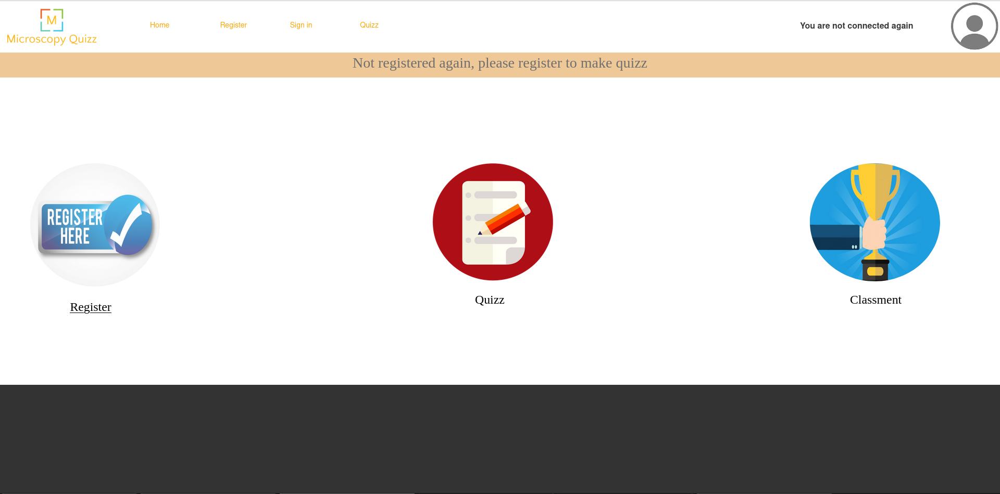
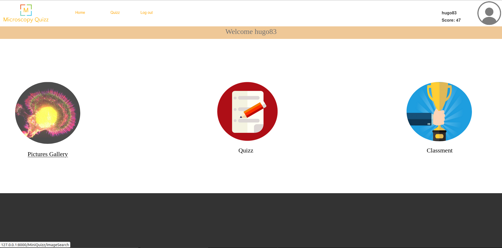
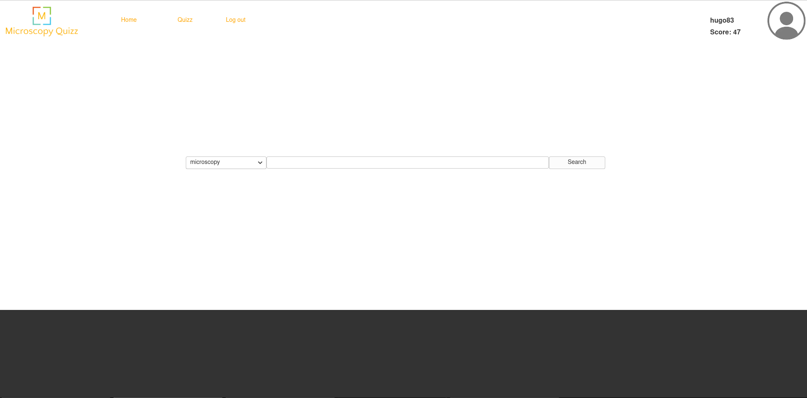
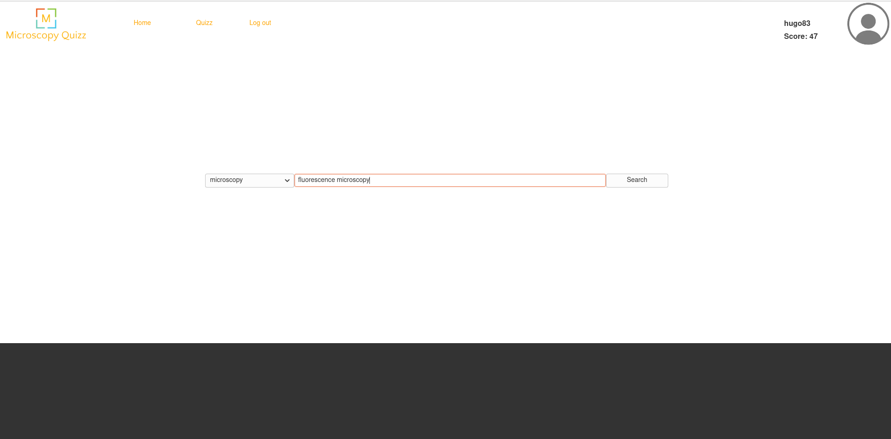
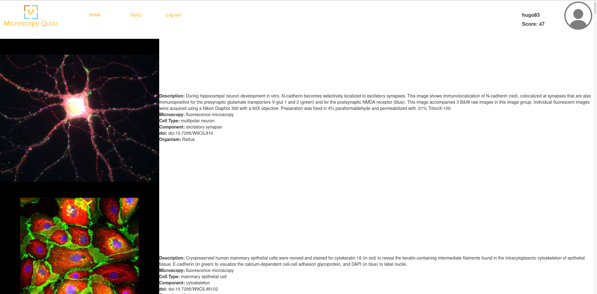
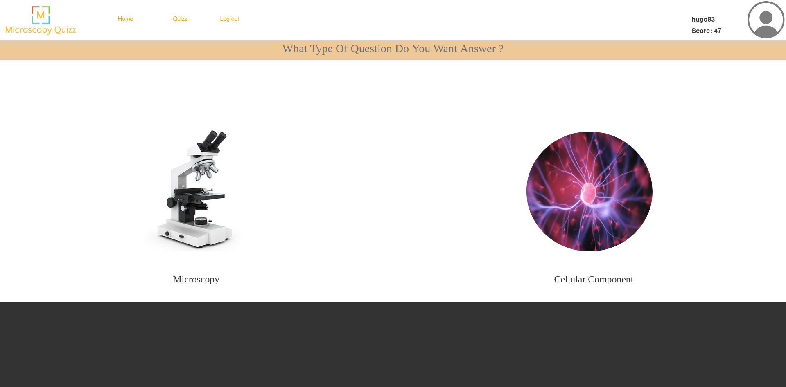
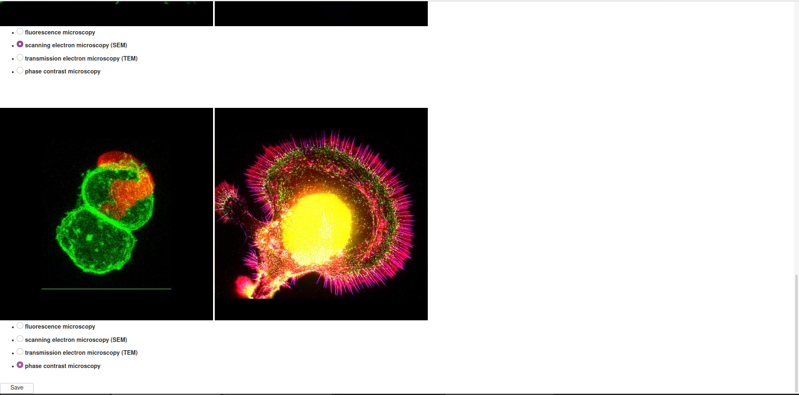
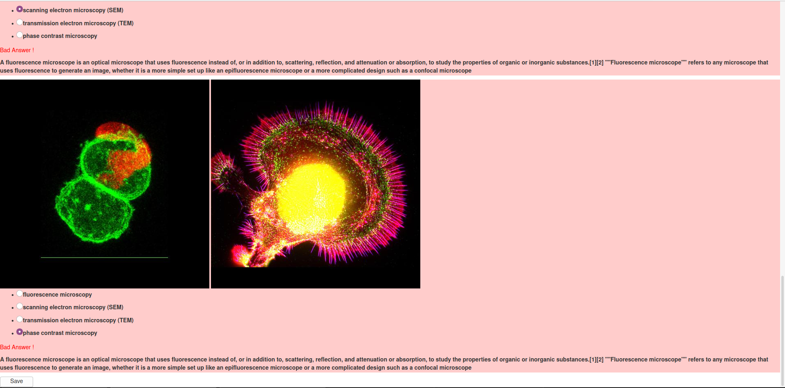
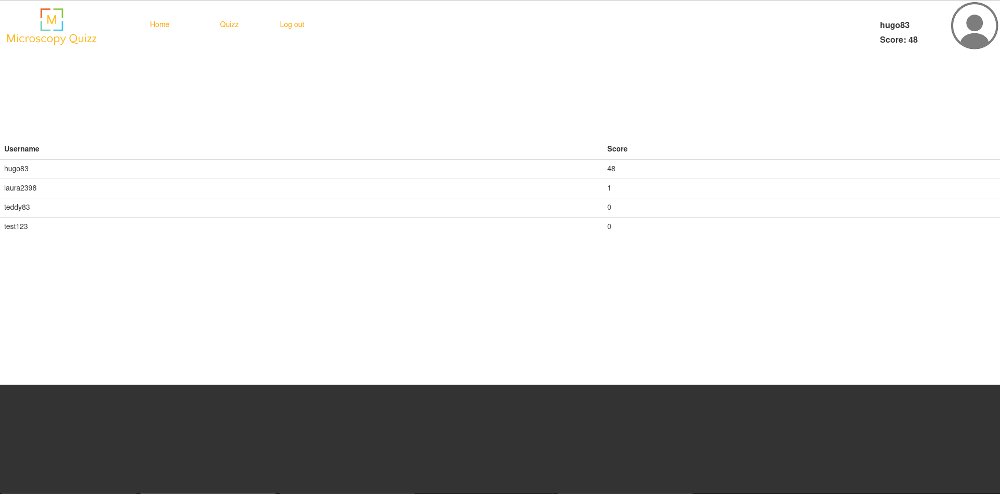

Auteur: **Hugo MARTIN**\
Date: **11/11/2020**

# Web Programming Project

[Use of website](#use-of-website)\
[For developers](#for-developers)

 

## Use of website

Once connected to the website, you must to create an account by selecting one **register** link. 

**Becareful, please enter a valid mail address, the website doesn't own alerts concerning invalid mail address.**

**Becareful, don't enter two times the same user and full all the registration form inputs.**

Once registered, you can complete a quizz, check your classification or check the pictures database.

### Pictures database

To check the pictures database, you must select the link to the database.

Once you clicked on the link, you must select in the items list, the item you wish search in the database.
 

Then, you can begin to type in the searchbar the item you wish to have pictures.

**Becareful, when you make a new pictures research, you must change the item in the searchbar to enable the autocompletion search, if you want to make a new search with the same item, change the item then select it again.**

 

### Quizz

To make a quizz, firstly, select the link corresponding to the quizz choices page. You can make two types of quizz, one concerning the different types of Microscopy and the other one deals with the identification of cellular components. 

Quizz are composed of a set of four questions, if you make a quizz concerning the different types of Microscopy, one good answer allows to win **1 point**, and for the other quizz, the good answer allows to win **3 points**.

When you selected all the answers, you must click on the **Save** button at the bottom of the page.

**Becareful, ensure when you clicked on the save button to have answered to all the questions. As for the registration form, the website doesn't verify if you validated all the answers.**

During the correction, good answers are highlighted in green and the bad ones in red. A description of the answer is displayed for each answer. To leave the page, you can click on the **Save** button at the bottom of the page.

 

### Checking the Classification

To check your classification, you must click on the appropriate link in the home page. A table displays and give you your relative position compared to the other registered users.

 

## For developers

A documentation about the installation of the webpage with the characteristics of this one is available following this [link](Documentation/README.md).
